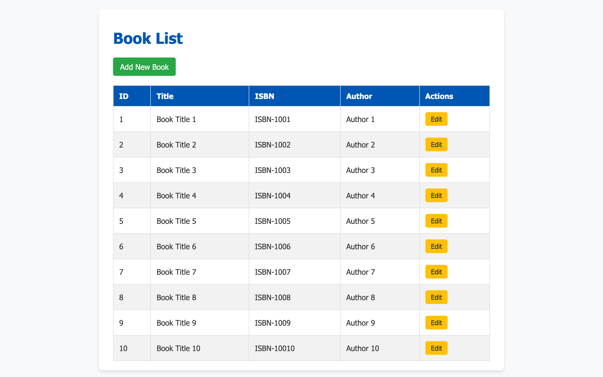
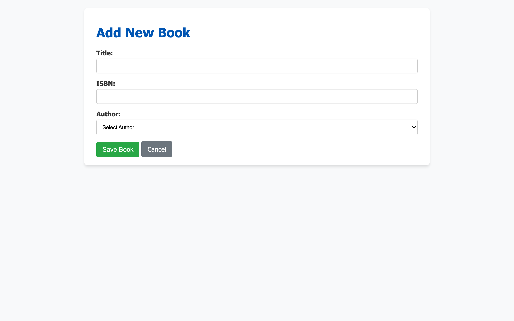
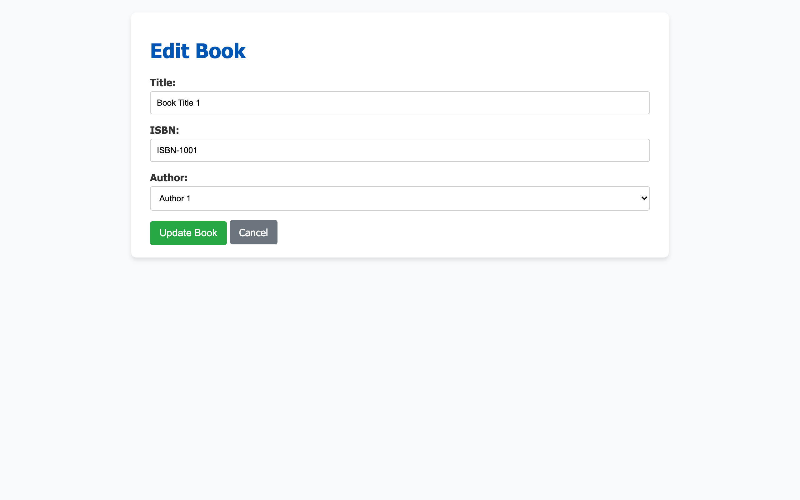

# Spring Boot Assignment Report

## Overview
This application manages two entities: **Books** and **Authors**. It supports reading all books, adding new books, and updating existing book details, with a user interface implemented in JSP.

## 1. Entity Relationship Design
- **Entities**: `Author` and `Book`
- **Relationship**: `OneToMany` from `Author` to `Book` (an author can have multiple books), and `ManyToOne` from `Book` to `Author`.
- **Primary Keys**: `id` auto-generated using identity strategies.
- **Constraints**: Book `isbn` and Author `name` are marked as unique, and properties like `title`, `name`, and `email` are non-nullable.

```java
@Entity
@Table(name = "authors")
public class Author {
    @Id @GeneratedValue(strategy = GenerationType.IDENTITY)
    private Long id;
    // ...
    @OneToMany(mappedBy = "author", cascade = CascadeType.ALL, fetch = FetchType.LAZY)
    private List<Book> books;
}

@Entity
@Table(name = "books")
public class Book {
    @Id @GeneratedValue(strategy = GenerationType.IDENTITY)
    private Long id;
    // ...
    @ManyToOne(fetch = FetchType.LAZY)
    @JoinColumn(name = "author_id", nullable = false)
    private Author author;
}
```

## 2. Implementation Details

### Database Initialization
The `DataLoader` class implements `CommandLineRunner` to populate the H2 database with 10 sample authors and 10 sample books upon application startup.

### Read Operation
- **Controller**: `@GetMapping("/books")` fetches the list of books via `libraryService.getAllBooksWithAuthor()` and maps it to `book-list.jsp`.
- **Repository Custom Query**: To avoid the N+1 problem, an inner join is explicitly requested and used:
  ```java
  @Query("SELECT b FROM Book b INNER JOIN FETCH b.author")
  List<Book> findAllBooksWithAuthor();
  ```
- **View**: `book-list.jsp` displays the entities in an HTML table formatted with CSS.


### Create Operation
- **Controller**: `@GetMapping("/books/add")` provides the view `book-form.jsp`. `@PostMapping("/books/add")` saves the `Book` linked to a selected `Author`.
- **Exception Handling**: Integrity constraint violations (e.g., duplicate ISBN) are caught and handled by redirecting the user back to the form with a descriptive error message using `RedirectAttributes.addFlashAttribute()`.


### Update Operation
- **Controller**: `@GetMapping("/books/edit/{id}")` populates a form with the book details. `@PostMapping("/books/edit/{id}")` processes the submitted edits.
- **Exception Handling**: Similar to creation, handled smoothly in the controller for uniqueness checks.


## 3. Testing
Comprehensive test suites are written leveraging JUnit and Mockito:
- **Repository Tests**: Validates the custom `JOIN` query using `@DataJpaTest`.
- **Service Tests**: Mocks the repository dependencies using `@InjectMocks` and `@Mock` to test `getAllAuthors()`, `getAllBooksWithAuthor()`, `saveBook()`, and `updateBook()`. 
All tests run successfully without any errors.

## 4. Challenges Faced & Solutions
1. **Handling N+1 Select Problems in the View**:
   - *Challenge*: Displaying the author's name next to the book's title natively triggered a new query per book.
   - *Solution*: Leveraged the JPQL custom query `SELECT b FROM Book b INNER JOIN FETCH b.author` within the repository to eagerly load relations in a single optimized query.
2. **JSP Rendering in Spring Boot 3**:
   - *Challenge*: Spring Boot primarily suggests Thymeleaf, making standard JSP setup slightly tricky due to modern embedded tomcat structures.
   - *Solution*: Successfully managed by properly specifying `<packaging>jar</packaging>` and importing Tomcat Embed Jasper and standard Jakarta JSTL dependencies.
3. **Database Constraints Handling**:
   - *Challenge*: Providing a user-friendly error to duplicate entries (like ISBN).
   - *Solution*: Wrapped service calls inside a try-catch for `DataIntegrityViolationException` in the Controller layer, keeping the application stable.

## 5. Github URL
- [Your GitHub Repository URL] (e.g., https://github.com/Suhassk205/Springboot-assignment-bits)
